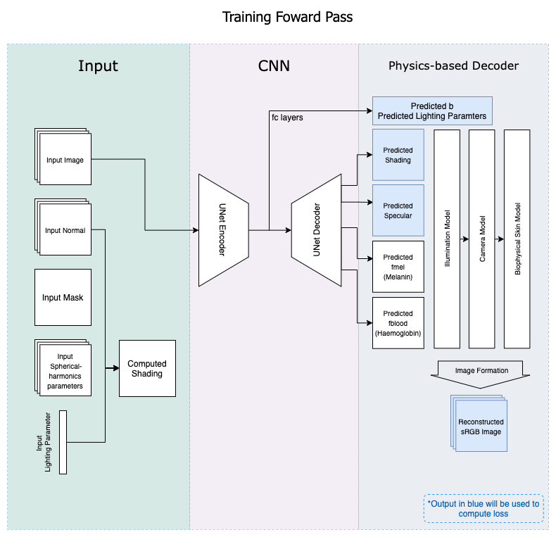
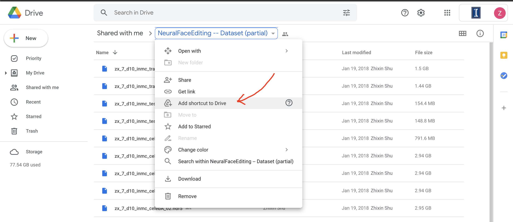
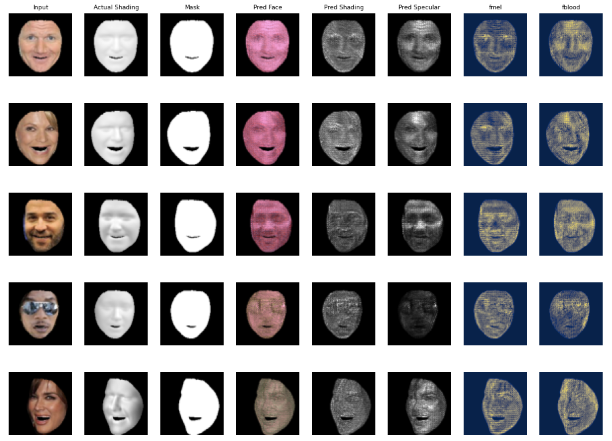
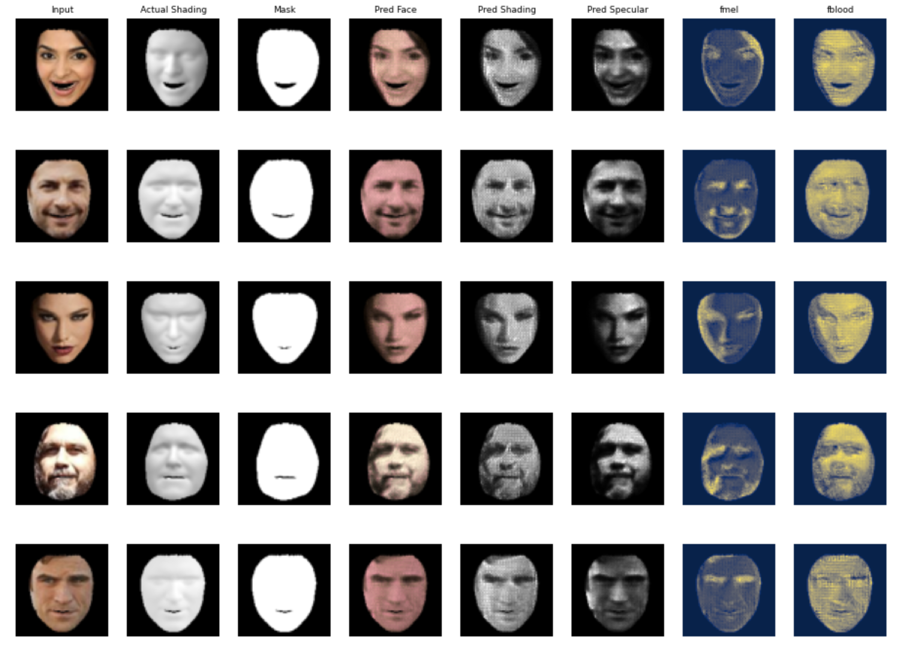
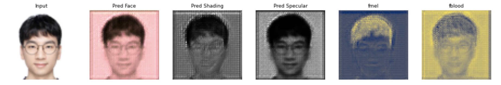

# Table of Contents
* 1\. [Introduction](#introduction)
* 2\. [How to Run](#how-to-run-trainpredict)
    * 2.1\. [Train](#train)
        * 2.1.1\. [On Local Machine](#on-local-machine)
        * 2.1.2\. [On Google Colab](#on-google-colab)
    * 2.2\. [Predict](#predict)
        * 2.2.1\. [On Local Machine](#predict-on-local-machine)
        * 2.2.2\. [On Google Colab](#predict-on-google-colab)
* 3\. [Results](#results)
    * 3.1\. [Training Setup](#training-setup)
    * 3.2\. [Results Interpretation](#results-interpretation)
    * 3.3\. [More Results](#more-results)
* 4\. [Potential Improvements](#potential-improvements)
* 5\. [Some Questions Unsolved](#some-questions-unsolved)


# Introduction
This is a pytorch implementation of the paper: [BioFaceNet: Deep Biophysical Face
Image Interpretation](https://arxiv.org/pdf/1908.10578.pdf). Either run locally or use BioFaceNet.ipynb for running on Google Colab. 

I've implemented the components and the model described in the network, and successfully trained the model. For some of the parts that I did not understand from the paper, I heavily relied on their Matlab implementation. Unfortunately, I did not have enough time to implement the test method using ISET multi-spectral dataset to quantitatively evaluate the performance of the model. Also, I'm sorry that I did check an implementation of BioFaceNet and from there I learned the fact that the paper is using a different augmented version of CelebA dataset instead of the regular one. (Sorry I can't unseen that)

The overall training forward pass is showed in the diagram below:



# How to Run (train/predict)
### Train
#### On Local Machine:
```Bash
# Clone this repo
git clone https://github.com/bznick98/BioFaceNet.git

# Prepare training data
"""
1. Data can be downloaded from google drive: https://drive.google.com/drive/folders/1UMiaw36z2E1F-tUBSMKNAjpx0o2TePvF
2. Training data are in pairs, for 1 set of training data, you need to download 2 hdf5 files. 
3. For instance, 'zx_7_d10_inmc_celebA_20.hdf5' has 2533 samples. To train on these 2533 samples, you also need to download the corresponding lighting parameters: 'zx_7_d3_lrgb_celebA_20.hdf5'. If you are trying to do a demo, then only data ending with number '20' and '05' are recommend to download. '20' and '05' has total about 12k samples.
4. After downloaded the data, you need to put them in directory data/, where data/ should be in the project root directory.
"""

# [Optional] Specify which data to train in train.py, by default will train 2533 samples in 'zx_7_d10_inmc_celebA_20.hdf5'
"""
Modify inmc_list and lrgb_list in function train() in train.py
"""

# [Optional] Set hyperparameters if not want to use default setting
"""
Hyperparameters can be modified by executing train.py with different arguments, see argparse part of train.py or execute 'python train.py -h' for detail.
"""

# Training
python train.py  # [with optional args]

# Models will be saved at checkpoints/ every epoch
```

#### On Google Colab:
```Bash
# Open BioFaceNet.ipynb using Google Colab or use this link: https://colab.research.google.com/drive/1F-91v0OipJ84UWtbKNeHDG8DdptGtEjK?usp=sharing
"""
BioFaceNet.ipynb is essentially a modified train.py, all the other related code will be pulled from github repo.
"""

# Prepare training data
"""
1. Data is stored in the Google Drive shared by Zhixin Shu, one of the authors of Neural Face Editing paper. 
2. To use the data, first open the shared google drive: https://drive.google.com/drive/folders/1UMiaw36z2E1F-tUBSMKNAjpx0o2TePvF
3. Click the toggle-down menu in the folder's title, select 'Add shortcut to Drive'.
4. Then you can access this folder in Colab by mounting your own google drive to Colab.
"""
```

```Bash
# Proceed to Google Colab
"""
Executing cell by cell or run all, models will be saved at '/content/BioFaceNet/checkpoints/'
"""
```

### Predict
#### Predict on Local Machine:
```Bash
# See python predict.py -h or argparser for detail, will use utils/test_img.png as input by default
python predict.py [optional args]
```
#### Predict on Google Colab:
```Bash
"""
Executing predict cell
"""
```

# Results
### Training Setup
I used a subset of the data listed in Google Drive ('20' & '05'), where there are approximately 12k data samples. 

Each training sample consists of a 3-channel rgb image, 3-channel normal map, 1-channel shading map, 3-channel spherical harmonics parameters map, as well as a vector of size 9 for lighting parameters. I trained without image augmentation for 20 epochs. 

### Results Interpretation
As you can see in the training progress visualization, reconstructed image are somewhat blurred in the first few epochs.  (The columns from left to right are: Input image, Actual Shading, Mask, Predicted Face, Predicted Shading, Predicted Specular, Melanin Map, Haemoglobin Map) 

Near the end of training, the reconstructed image is really close to the original image. The specular maps it produces are also visually reasonable.  Since I didn't implement the testing benchmarks using ISET multi-spectral dataset proposed by the paper, I couldn't know how well or bad the model predicts the melanin and haemoglobin maps. But from the prediction visualizations, I could tell the melanin maps focuses on the darker part of the skin (such as hair, eye areas, even shaded/occluded areas), and haemoglobin maps focuses more on the whole face area.


### More Results
Inference results using my face: 


# Potential Improvements
1. Basic data augmentation such as flipping can be applied to the dataset to avoid overfitting since the amount of training samples are small.

2. For melanin maps, it seems like the highlights areas are more focused on visually darker areas such as hair, eyebrows, beard and EVEN shaded areas. To avoid the last situation where melanin predictions are affected by lighting conditions, is it possible to use images with specular and shades removed as input? (Such as the diffuse albedo showed in paper Figure.5)

# Some Questions Unsolved
1. In Biophysical Skin Model, I did not understand how paper's formula of R(fmel, fblood, lambda) relates to their Matlab implementation, so I just followed their Matlab implementation that bilinearly sample from New_skin_color matrix using fmel & fblood value.

2. There are a couple of matrices that are directly loaded from file in their Matlab implementation, such as rgbCMF.mat, illF.mat, illumA.mat, illumDmeasured.mat, Newskincolour.mat. Except for rgbCMF, which I found the 28 cameras sensitivity dataset and got the same results, I did not know how the other matrices came from.

3. Again for Biophysical Skin Model, the paper says melanin volume is restricted to 1.3% ~ 43%, and haemoglobin volume is restricted to 2% ~ 7%. I don't know how these percentages are reflected on the model's output. Currently the model's output for melanin and haemoglobin are raw numbers, and I only normalize them to 0 ~ 1 when visualizing.

4. Currently, the reconstructed appearance will sometimes shifted to red. I guess it might due to the issues in my color transformation pipeline.

5. In the PCA of Camera Model, I got the same rgbCMF matrix as the Matlab implementation, however, the total explained variance of the first two principle components are like 40%~50%, instead of 97% stated in the paper. There might be some issue in my camera model's PCA implementation.